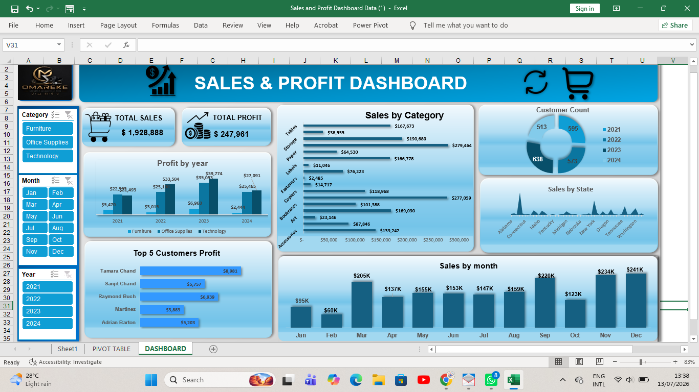

# 📊 Sales & Profit Dashboard (Microsoft Excel)

## Project Overview

This project presents an interactive Sales & Profit Dashboard built in Microsoft Excel to help business stakeholders monitor sales performance, profitability, customer trends, and product performance.

The dashboard enables users to filter data by Category, Month, and Year using interactive slicers, making it easier to identify trends and support business decisions.

---

## Business Problem

Businesses often struggle to monitor sales performance across different product categories, customers, and time periods. This dashboard provides a centralized view of key performance indicators (KPIs) to support data-driven decision-making.

---

## Tools Used

- Microsoft Excel
- Pivot Tables
- Pivot Charts
- Slicers
- KPI Cards
- Data Cleaning
- Dashboard Design

---

## Dashboard Features

- Total Sales KPI
- Total Profit KPI
- Sales by Category
- Profit by Year
- Sales by Month
- Customer Count
- Top 5 Customers by Profit
- Interactive Filters (Category, Month, Year)

---

## Key Insights

- Total Sales: **$1,928,888**
- Total Profit: **$247,961**
- December recorded the highest monthly sales.
- Technology generated the highest profit in recent years.
- A small number of customers contributed significantly to overall profit.

---

## Business Recommendations

- Increase investment in high-performing product categories.
- Strengthen marketing during high-performing months.
- Develop loyalty programs for top customers.
- Review low-performing products and regions to improve profitability.

---

## Dashboard Preview

## Dashboard Preview

---

## Author

*Ndifreke Michael*

Aspiring Data Analyst | Microsoft Excel | SQL | Power BI | Data Visualization
